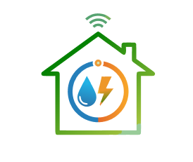

# 🏠 ISUMS - Mobile Application

<div align="center">
  
  
  **Capstone Project - Mobile Application**
  
  [](https://reactnative.dev/)
  [](https://expo.dev/)
  [](https://www.typescriptlang.org/)
</div>

---

## 📋 Mô tả

ISUMS là ứng dụng mobile được xây dựng bằng React Native và Expo Framework, phục vụ cho đồ án tốt nghiệp.

## 🚀 Công nghệ sử dụng

- **React Native** - Framework phát triển ứng dụng mobile
- **Expo** - Toolchain và platform cho React Native
- **TypeScript** - Ngôn ngữ lập trình với type safety
- **Zustand** - State management (quản lý state dùng chung)
- **React Query (@tanstack/react-query)** - Quản lý server state và API calls
- **Axios** - HTTP client để gọi API

## 📁 Cấu trúc thư mục

```
ISUMS/
├── src/
│   ├── features/
│   │   ├── auth/             # Các màn hình, logic và hook dành cho đăng nhập/đăng ký/quên mật khẩu
│   │   ├── house/            # Dashboard tenant/landlord/manager, profile, danh sách cư dân
│   │   ├── consumption/      # Đặt mục tiêu tiêu thụ điện/nước
│   │   ├── billing/          # Màn hình hóa đơn & thanh toán
│   │   └── ...               # Các tính năng khác theo nghiệp vụ
│   ├── shared/
│   │   ├── components/        # Component tái sử dụng như Footer navigator, modal
│   │   ├── hooks/             # Custom hook dùng chung app
│   │   ├── services/          # Mock API, axios, config
│   │   ├── theme/             # Icon/theme helper
│   │   ├── types/             # Định nghĩa TypeScript dùng chung
│   │   └── utils/             # Hàm tiện ích (formatDate, validation...)
│   ├── navigation/            # Cấu hình navigator
│   ├── store/                 # Zustand/global state
│   ├── styles/                # Style riêng cho từng màn hình
├── assets/                    # Hình ảnh, icon, splash...
│   ├── favicon.png
│   ├── icon.png
│   ├── iconRetanlHouse.png
│   ├── splash-icon.png
│   └── adaptive-icon.png
├── App.tsx                    # Component gốc của ứng dụng
├── index.ts                   # Entry point
├── app.json                   # Cấu hình Expo
├── package.json               # Dependencies và scripts
└── tsconfig.json              # Cấu hình TypeScript
```

## 🛠️ Cài đặt và chạy

### Yêu cầu hệ thống

- Node.js (phiên bản 18 trở lên)
- npm hoặc yarn
- Expo CLI (hoặc Expo Go app trên điện thoại)

### Cài đặt

1. **Clone repository:**
   ```bash
   git clone https://github.com/Management-System-for-Rental-SEP490/ISUMS_MOBILE_APP.git
   cd ISUMS_APP/ISUMS
   ```

2. **Cài đặt dependencies:**
   ```bash
   npm install
   ```

3. **Chạy ứng dụng:**
   ```bash
   npm start
   ```
   
   Hoặc chạy trên platform cụ thể:
   ```bash
   npm run android    # Chạy trên Android
   npm run ios        # Chạy trên iOS (chỉ macOS)
   npm run web        # Chạy trên web browser
   ```

4. **Quét QR code:**
   - Mở app **Expo Go** trên điện thoại
   - Quét QR code hiển thị trên terminal
   - Ứng dụng sẽ tự động load

## 📱 Screenshots

<div align="center">
  
  <p><em>App Icon</em></p>
</div>

## 🎯 Tính năng chính

- ✅ Cấu trúc project rõ ràng, dễ bảo trì
- ✅ TypeScript cho type safety
- ✅ Zustand cho state management
- ✅ React Query cho quản lý API calls
- ✅ Hỗ trợ Android, iOS và Web

## 📚 Tài liệu tham khảo

- [React Native Documentation](https://reactnative.dev/docs/getting-started)
- [Expo Documentation](https://docs.expo.dev/)
- [Zustand Documentation](https://zustand-demo.pmnd.rs/)
- [React Query Documentation](https://tanstack.com/query/latest)

## 👤 Tác giả

**Anh Khoa FPT**

- GitHub: [@Anh-Khoa-fpt](https://github.com/Anh-Khoa-fpt)

## 📄 License

This project is private and for educational purposes only.

---
